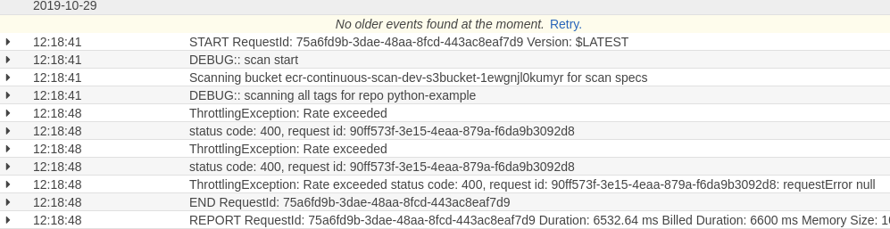

# ECR Container Image Re-Scan

Based entirely on [Michael Hausenblas's implementation](https://github.com/mhausenblas/ecr-continuous-scan)

Just ported some of the functionality to use Serverless instead + removed the need for init buckets


## Serverless Deploy

```bash
serverless deploy
```

## Test

Retrieve the endpoint created for you and export a variable containing it.

```bash
# Serverless: Stack update finished...
# endpoints:
#   POST - https://jn03zi6twg.execute-api.us-east-1.amazonaws.com/dev/configs
#   DELETE - https://jn03zi6twg.execute-api.us-east-1.amazonaws.com/dev/configs/{id}
#   GET - https://jn03zi6twg.execute-api.us-east-1.amazonaws.com/dev/configs
#   GET - https://jn03zi6twg.execute-api.us-east-1.amazonaws.com/dev/summary
#   GET - https://jn03zi6twg.execute-api.us-east-1.amazonaws.com/dev/findings/{id}

export ECRSCANAPI_URL="https://jn03zi6twg.execute-api.us-east-1.amazonaws.com/dev"
```

### Create the demo repo

```bash
./container_push.sh
```

### Add a configuration file

```bash
curl -s --header "Content-Type: application/json" --request POST --data @sample-config.json $ECRSCANAPI_URL/configs/
```

## Issues

You might get rate limited from the ECR Vuln scanner


